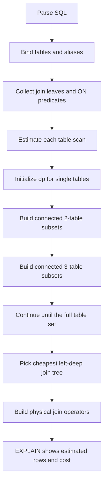

# Teaching CamusDB to choose better query plans

One of the most interesting parts of building CamusDB is the query optimizer.
It might also be one of the most complex pieces of machinery in the whole
database.

At first, a query optimizer sounds simple: receive a SQL query and decide how
to run it. But the more features a database supports, the harder that decision
becomes. A query can use a table scan, an index lookup, an index range scan, a
hash join, a merge join, a nested loop join, a sort, an aggregate, a derived
table, or a subquery. Each option can be correct, but not every option is fast.

The optimizer's job is to choose a good plan before the query runs.

<!-- truncate -->

That is a difficult job because SQL is declarative. When a user writes:

```camussql
SELECT u.email, p.title, c.body
FROM users u
JOIN posts p ON p.user_id = u.id
JOIN comments c ON c.post_id = p.id
WHERE u.active = true;
```

they are not saying:

1. Read `users` first.
2. Then join `posts`.
3. Then join `comments`.

They are saying what result they want. The database must decide the how.

## Why join order matters

For small queries, the difference may not look important. For larger tables, it
can be huge.

Imagine this:

- `users` has many rows, but only a few are active.
- `posts` has many rows for each user.
- `comments` has many rows for each post.

If CamusDB starts with all comments, then joins posts, then joins users, it may
touch a lot of data before discovering that most rows do not match
`u.active = true`.

If it starts with the filtered active users, it may reduce the problem much
earlier. The final result is the same, but the amount of work can be very
different.

This is where the optimizer becomes more than a parser or a set of simple
rules. It has to reason about cost.

## The search space grows fast

The hard part is that join order has many possibilities.

With two tables, there are only a few choices. With three tables, there are
more. With five, six, or seven tables, the number of possible orders grows very
quickly.

A naive optimizer could try every possible order, estimate the cost of each
one, and pick the cheapest. That works for tiny cases, but it does not scale
well. The optimizer itself would become too slow.

This is a classic database problem. CamusDB now uses a System-R-style dynamic
programming approach for eligible inner joins when cost-based join ordering is
enabled.

The idea is simple enough to explain, even if the implementation has many
details.

Instead of asking "what is the best plan for the whole join?" immediately, the
optimizer asks smaller questions first:

- What is the best plan for `users`?
- What is the best plan for `posts`?
- What is the best plan for `comments`?
- What is the best plan for `users JOIN posts`?
- What is the best plan for `posts JOIN comments`?
- Can those smaller answers help build the best larger answer?

Dynamic programming is useful here because it remembers the best answer for a
smaller subset of tables and reuses it later. It avoids doing the same work
again and again.

## A small mental model

Think of the optimizer as filling a table of partial plans.

First, it estimates the best way to access each individual table. Maybe one
table should use an index. Maybe another should use a full scan.

Then it looks at pairs of tables that can be joined. For each pair, it asks:

- Can this pair be joined with an indexed nested loop?
- Is a hash join cheaper?
- Can both sides arrive ordered, making merge join possible?
- How many rows will probably come out?
- How expensive is the intermediate result?

Then it does the same for three-table groups, then four-table groups, and so
on, always building from the best smaller plans it already found.

At the end, it has a candidate plan for the full query.

This does not mean the optimizer has perfect knowledge. It is still estimating.
But it is estimating in a structured way.

## A more technical view

The dynamic programming part works by keeping a memo table. In CamusDB, the
main idea is:

```text
dp[set of tables] = cheapest known left-deep plan for exactly that set
```

For a query with three tables, the optimizer first creates entries for single
tables:

```text
dp[{users}]
dp[{posts}]
dp[{comments}]
```

Each entry stores more than the table name. It stores a partial plan, the
estimated cost, and the estimated number of rows that the partial plan will
produce.

Then CamusDB tries to build larger entries from smaller ones:

```text
dp[{users, posts}]
dp[{posts, comments}]
dp[{users, comments}]
dp[{users, posts, comments}]
```

The recurrence is roughly:

```text
best(S) =
  min over each table R in S:
    best(S - R) joined with R
```

There is one important rule: CamusDB only considers a join when there is a
connecting predicate between the existing left side and the new right table.
That prevents the optimizer from inventing cross products for normal joins.

For each possible extension, the optimizer asks which join shape is cheaper.
For example:

- If the right table has an index on the join key, an indexed nested-loop join
  may be cheap.
- If repeated index probes look expensive, a hash join may be cheaper.
- If both sides can arrive ordered by the join key, a merge join can become a
  good option.

In simplified form, the optimizer is doing this:

```text
candidate_cost =
  cost(best_left_plan)
  + cost(join best_left_plan with next_table)
```

If the new candidate is cheaper than the current `dp[S]`, it replaces it.



The real implementation has more details, but this is the core shape.

## Why left-deep plans?

CamusDB currently searches left-deep join trees. A left-deep plan looks like
this:

```text
(((users JOIN posts) JOIN comments) JOIN reactions)
```

The left side grows one table at a time, and each step adds one new table on
the right.

There are also bushy plans, where both sides of a join can already be joined
subtrees:

```text
(users JOIN posts) JOIN (comments JOIN reactions)
```

Bushy plans can be useful, but they make the search space larger. For now,
CamusDB keeps the search practical by using left-deep plans for this DP pass.
That is a common and useful step for a database optimizer.

The search also has boundaries:

- It is used for eligible inner joins.
- It works with `JOIN ... ON` predicates that can be safely reordered.
- It is capped for very wide joins, so planning stays bounded.
- Unsupported shapes fall back to the heuristic join order.

These limits are not failures. They are part of making the optimizer safe and
incremental.

## Statistics make the optimizer smarter

Dynamic programming gives CamusDB a better way to search. Statistics give it
better numbers to search with.

CamusDB can use table statistics, index counts, histograms, min/max values, and
distinct-value counts collected by `ANALYZE`. These values help answer
questions like:

- How many rows are in this table?
- How selective is this filter?
- Is this index likely to return a small number of rows?
- How many rows might this join produce?

For example:

```camussql
ANALYZE TABLE users;
ANALYZE TABLE posts;
ANALYZE TABLE comments;
```

After that, the optimizer has more information for cost estimates.

You can inspect the result with:

```camussql
EXPLAIN
SELECT u.email, p.title, c.body
FROM users u
JOIN posts p ON p.user_id = u.id
JOIN comments c ON c.post_id = p.id
WHERE u.active = true;
```

`EXPLAIN` shows the selected physical plan and the estimated rows and cost.
That makes the optimizer less mysterious. You can see whether CamusDB picked a
hash join, merge join, indexed nested loop join, or a fallback nested loop
join.

## Why this is hard in a real database

The clean explanation is only part of the story.

In the real engine, the optimizer has to deal with many constraints:

- It must preserve SQL semantics.
- It must respect join predicates.
- It must not reorder joins when that would change the result.
- It must understand which indexes are available.
- It must estimate row counts from imperfect statistics.
- It must choose between different join algorithms.
- It must still produce a plan quickly.

This is why the query optimizer is such complex machinery. It sits between the
friendly SQL that users write and the lower-level storage operations that the
database must execute.

When it works well, users should not have to think too much about it. They
write SQL, create useful indexes, run `ANALYZE` when data changes, and the
database does the best it can.

## Keeping the system practical

CamusDB still keeps the cost-based optimizer behind configuration flags:

```yaml
cost_based_access_path_enabled: true
cost_based_join_order_enabled: true
```

That is intentional. The rule-based planner remains stable and predictable.
The cost-based planner can be enabled when you want CamusDB to compare more
plans and use statistics to make better choices.

This is also useful while the database is still evolving. Query optimizers are
not finished in one pass. They improve over time, as more query shapes, more
statistics, and more execution strategies become available.

## Why I like this feature

Dynamic programming is one of those ideas that feels elegant because it turns a
large problem into smaller reusable pieces.

It does not remove the complexity of query optimization. It gives the
complexity a shape.

That is exactly the kind of engineering I enjoy in CamusDB. The user sees a SQL
query. Underneath, the database is making many decisions: how to read, how to
join, how much data it expects, and which path is probably cheaper.

There is still a lot to improve, but this is an important step. CamusDB is
moving from "can this query run?" toward "can this query run with a plan that
makes sense?"

For a database, that is a big milestone.
